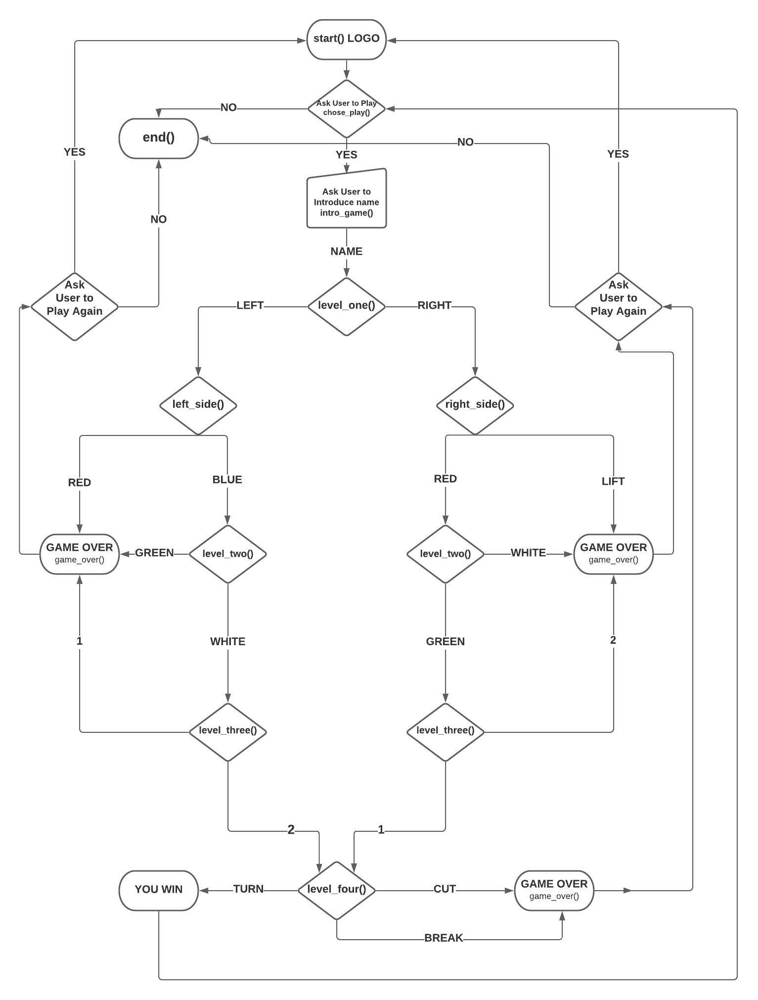

# Table of Contents

  - [Introduction](#introduction)
  - [UX](#ux) 
  - [User Stories](#user-stories)
    - [Strategy](#strategy)
      - [Main Goal](#main-goal)
    - [User Needs](#user-needs)
      - [Scope](#scope)
  - [Features](#features)
  - [Structure](#structure)
  - [Skeleton](#skeleton)
      - [Lucid Charts](#lucid-charts)
    - [Technology Used](#technology-used)
  - [Testing](#testing)
    - [Functionality Testing](#functionality-testing)
    - [Performance Test](#performance-test)
    - [Validator testing](#validator-testing)
  - [Bugs found on PEP8](#bugs-found-PEP8)
  - [Deployment](#deployment)
  - [Credits](#credits)
      - [Media](#media)
      - [Code](#code)
  # MAZE

**[LIVE DEMO - Click & Play ](https://maze-ci.herokuapp.com/)**

  ## Introduction
  
  The Maze is a text adventure game where the user’s decisions drive the story. 
  The user will be to navigate through the complex paths of  the maze without being killed by robots. Depending on user decision the game will continue or end the game. If the user takes the wrong choice, then the game will be over and given the option to try again.

  # UX

  ### User Stories

  ### Strategy

   #### Main Goal
   - create an attractive text adventure game using Python
   - create an provide the user  with a simple and enjoyable game to play
   - reach to people wishing to play text adventure game
  ### User Needs
  #### Scope
  - to understand how the play the game 
  - the game to have a compelling story
  - the choices being made to feel like they have consequences
  - players to enjoy the experience playing this game
  - when game is completed to have the option to play again

### Structure
    After the game introduction and name input the user is asked which way he will take (Left or Right) each side is different game  that have 4 levels each .Each level has two choices except the last one that has 3 . On all levels there is only one option that give access to the player to continue the game .If the user chooses the wrong option the game will end and the user will be asked if he wants to play again.
### Features

[Game Intro - code photo](screenshot/game_intro_content.PNG)

- Game starts with an introduction that provides a new identity and location according to the game
 and a two ways option

[User Name Input - code photo](screenshot/user_name.PNG)

- User will be asked  to introduce his name to continue the game. User name will be displayed at the end of the game,if wins.
  
[Game Decision - code photo](screenshot/play_decision.PNG)

- During the game the user will be asked  to introduce his answer/choice to continue the game.
  
[Game Over - code photo](screenshot/game_over.PNG)

- If during the game the user will be asked to  introduce his answer/choice to continue the game and the answer/choise is wrong the game is over .After the user will be asked if he wants to try again.
   
[End Game - code photo](screenshot/end_game.PNG)

- When user reach to the point when game is over and is asked if he wants to try again and the answer is negative , the user will exit the game.
  

### Skeleton
- for the chart was used [Lucid Charts](https://www.lucidchart.com/pages/landing?utm_source=google&utm_medium=cpc&utm_campaign=_chart_en_tier1_mixed_search_brand_exact_&km_CPC_CampaignId=1490375427&km_CPC_AdGroupID=55688909257&km_CPC_Keyword=lucidchart&km_CPC_MatchType=e&km_CPC_ExtensionID=&km_CPC_Network=g&km_CPC_AdPosition=&km_CPC_Creative=442433236001&km_CPC_TargetID=aud-812368091438:kwd-33511936169&km_CPC_Country=1007850&km_CPC_Device=c&km_CPC_placement=&km_CPC_target=&mkwid=sSyVrRTB8_pcrid_442433236001_pkw_lucidchart_pmt_e_pdv_c_slid__pgrid_55688909257_ptaid_aud-812368091438:kwd-33511936169_&gclid=CjwKCAiAqIKNBhAIEiwAu_ZLDs6UYDUqlCQUexUrHdY4-q8WcDstPcsgQLhqOhcEcJYpq-h6ZhHGexoCTSkQAvD_BwE)

#### Technology Used
- Python
- Heroku
- GitHub
- GitPod
- Lucid Charts

### Testing

- project has been in tested in GitPod and Heroku terminal
- tested with input of invalid anwer choices 
- the game has been played accessing all options to check if is working corectly 

### Bugs found on PEP8

- to many character on one line 
- unwanted white spaces

### Deployment
Steps :
- make an account with Heroku
- fork or clone this repository
- ensure that the Profile is in place
- create a new app in Heroku
- select "New" and "Create new app"
- add name for the app and press "Create new app"
- in "Settings" select "BuildPack" and select Python and Node.js
- in "Settings" click "Reveal Config Vars" and input the fallowing key : PORT,VALUE:8000.
- press on "Deploy" and select your method and repository
- press "Connect" on selected repository
- choose beween "Enable Automatic Deploys" or Deploy Branch" in the    manual deploy section
- Heroku will now deploy the site

### Credits
[YouTube video](https://www.youtube.com/watch?v=DEcFCn2ubSg) structure inspiration

#### Media

The ideea came seen this movie: [The Maze Runner](https://www.denofgeek.com/movies/the-maze-runner-review-2/)

#### Code

[Love Sanwiches](https://learn.codeinstitute.net/courses/course-v1:CodeInstitute+LS101+2021_T1/courseware/293ee9d8ff3542d3b877137ed81b9a5b/58d3e90f9a2043908c62f31e51c15deb/) by Code Institute as a general resource.

[GeeksforGeeks](https://www.geeksforgeeks.org/python-programming-language/) as a general resource.

[W3School](https://www.w3schools.com/) as a general resource.